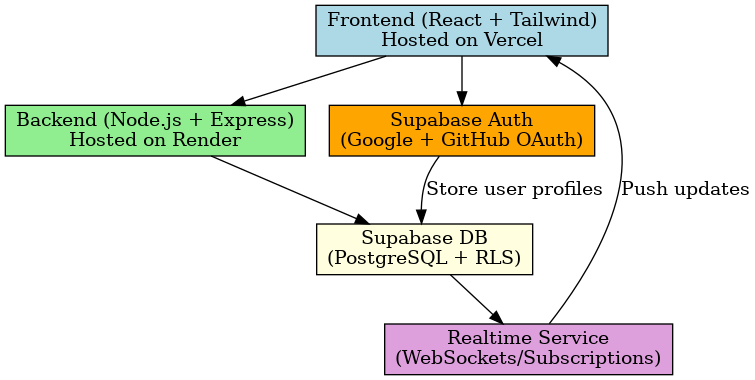

# 📝 Todo Task Management App

A full-stack task management application built for the Katomaran Hackathon. It allows users to sign in with Google or GitHub and manage their tasks efficiently in real-time.

---

## 🚀 Live Demo

🌐 [View App Here](https://t-o-d-o.lovable.app)

---

## 🎥 Project Demo (Loom Video)

▶️ [Watch the Demo](https://www.loom.com/share/348203a22b924b4ca3ada5fa5d3f11b4?sid=4bb8e67d-8fa7-4d89-a640-1ed58880b949)

---

## 🛠️ Tech Stack

- **Frontend:** React.js, Tailwind CSS
- **Backend:** Node.js, Express.js
- **Database & Auth:** Supabase
- **Deployment:** Vercel (Frontend), Render (Backend)

---

## 🔐 Features

- ✅ Google Sign-in via Supabase Auth
- ✅ GitHub Sign-in via Supabase Auth
- ✅ Add / Update / Delete Tasks
- ✅ Real-Time Task Updates
- ✅ Fully responsive UI
- ✅ Deployed & ready to use

---

## 👩‍💻 Developed By

**Keerthika S**  
B.Tech CSBS (Computer Science and Business Systems)  
Final Year Student

---

## 📁 Folder Structure

```plaintext
client/         # React Frontend
server/         # Node.js Backend
README.md       # Project Overview


## 🧩 Architecture Diagram




---
